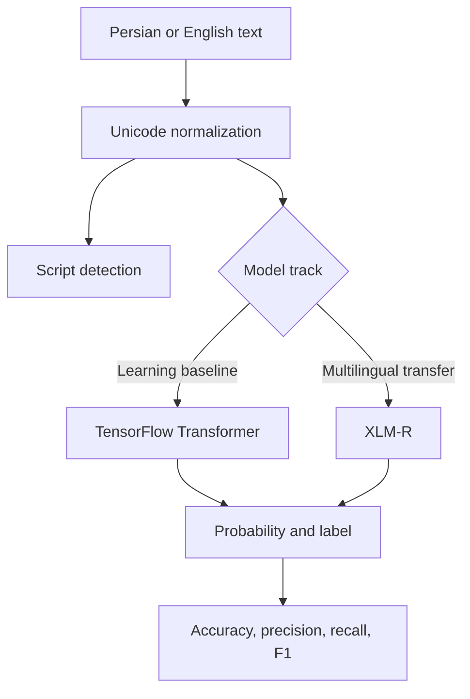

# Multilingual Sentiment Transformer Lab

[](https://github.com/aminbakhtiari777/Movie-Review-Sentiment-Classification-with-Transformer/actions/workflows/ci.yml)
[](https://www.python.org/)
[](#multilingual-roadmap)
[](LICENSE)

A portfolio-grade NLP laboratory that evolves an English IMDB Transformer notebook into a testable Persian-English sentiment system. It separates lightweight language and evaluation logic from optional deep-learning stacks, so CI stays fast while both TensorFlow and XLM-R experiments remain reproducible.

## What is verified

| Capability | Evidence | Status |
| --- | --- | --- |
| English sentiment baseline | IMDB notebook, 25,000 test reviews | **85.99% test accuracy** |
| Persian/English normalization | Automated unit tests | Verified |
| Script-aware language detection | Persian, English, mixed, unknown tests | Verified |
| Binary evaluation | Hand-checked confusion matrix and metrics | Verified |
| Multilingual XLM-R pipeline | Reusable fine-tuning script | Ready for training |
| Multilingual model quality | Requires a labeled Persian-English dataset | Not yet benchmarked |

The 85.99% result belongs only to the original English IMDB experiment. This repository does **not** present it as a Persian benchmark.

## Architecture



## Repository layout

```text
notebooks/                 original reproducible IMDB experiment
scripts/train_imdb.py      English Transformer training
scripts/fine_tune_multilingual.py  XLM-R CSV fine-tuning
src/multilingual_sentiment/
  text.py                  Persian/English normalization and detection
  evaluation.py            dependency-free binary metrics
  prediction.py            stable prediction contract
  models.py                lazy TensorFlow and XLM-R builders
tests/                     fast unit tests
docs/MODEL_CARD.md         scope, limitations, and responsible use
```

## Quick start

```bash
python -m venv .venv
source .venv/bin/activate
pip install -r requirements.txt
pytest
```

Run the historical English experiment:

```bash
pip install -e ".[tensorflow]"
python scripts/train_imdb.py --epochs 5 --output artifacts/imdb_transformer.keras
```

Fine-tune the multilingual track from CSV files containing `text,label` columns:

```bash
pip install -e ".[multilingual]"
python scripts/fine_tune_multilingual.py \
  --train data/train.csv \
  --validation data/validation.csv \
  --output artifacts/xlmr-sentiment
```

Labels must be `0` for negative and `1` for positive. A production dataset should include native Persian, native English, informal text, spelling errors, code-switching, and balanced labels.

## Experiment record

The preserved notebook trains a compact 681,857-parameter Transformer-like classifier on Keras IMDB:

- vocabulary: 10,000 tokens
- sequence length: 200
- attention heads: 2
- early stopping: patience 2
- observed test loss: 0.3346
- observed test accuracy: **0.8599**

The reusable TensorFlow builder improves the research design by adding learned positional embeddings and a complete feed-forward residual block.

## Multilingual roadmap

1. Curate and document a Persian-English labeled dataset.
2. Establish majority and TF-IDF baselines.
3. Fine-tune XLM-R with a validation split.
4. Report per-language F1, confusion matrices, calibration, and code-switch performance.
5. Export an optimized inference artifact only after error analysis.

See [the model card](docs/MODEL_CARD.md) for limitations and evaluation requirements.
